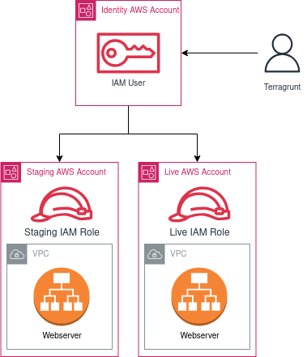

# terragrunt-aws-multi-account
This is an example of how Terragrunt can be used to manage an environment with multiple AWS accounts. 

The folder structure is like this:
```
root.hcl
  account/
    account.hcl
    region/
      region.hcl
      environment/
        environment.hcl
        resource/
          terragrunt.hcl
  common/
    resource.hcl
  modules/
    resource/
      terraform.tf
```

To apply a single resource, you can run Terragrunt from within the environment specific directory. For example, to apply the VPC for Staging: 
```
cd staging/us-east-1/staging/vpc/
terragrunt apply
```

# An overview of what Terragrunt is doing

Terragrunt will traverse the directory tree upwards and collect the configuration for the *environment*, *region* and *account*, as well as the configuration in *common* and *root*. 

It generates temporary Terraform code within a `.terragrunt-cache` directory, and runs Terraform. 

## root.hcl

This is is the base of the configuration at the top of the directory tree. 

The `generate provider {}` and `generate backend {}` blocks allow Terragrunt to create a configuration that is specific to each resource. This also keeps the state files small, and allows us to store them on the same account as the resource for better access control.  

## Webserver example

This example deonstrates how Terragrunt passes data between resources. 

`modules/webserver/` is a Terraform module. It contains no Terragrunt configuration. 

`common/webserver.hcl` contains these blocks: 
- `locals {}` collects Terragrunt configuration about the *environment* and *region*, and tells Terragrunt where to find the Terraform module. 
- `dependency "vpc" {}` tells Terragrunt to collect outputs from the VPC resource, by pointing to it's environment specific configuration. 
- `inputs = {}` tells Terragrunt what values to feed into the inputs of the webserver Terraform module. 

# AWS Configuration 


In this example we are using 3 AWS accounts. The *Identity* account contains the IAM User credentials that the awscli is authenticating with. The *Staging* and *Live* accounts contain resources that we want to manage. 

Access to resources is governed at the IAM Role policy level, on the account where the resource lives. 

Terragrunt authenticates as an IAM User in the *Identity* AWS account when Terraform wraps the awscli on the local system. Terragrunt then assumes the IAM Role needed to manage the resource by reading the `iam_role` attribute, which in our case is specified in the account level configuration `account.hcl`. 
